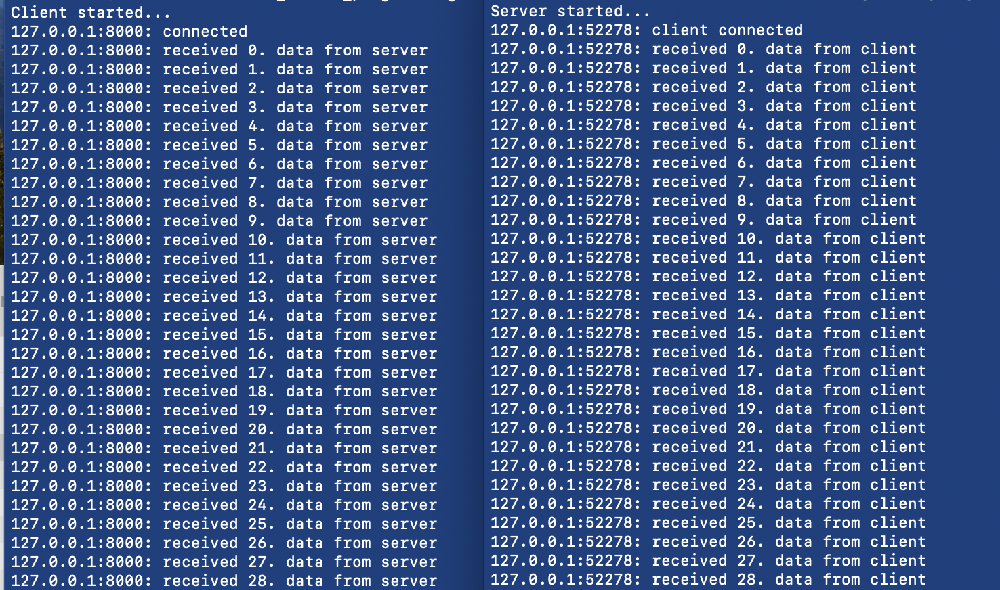

## Code 1:

### Terminal 1:
- go run server.go  (listens on localhost:9988)
### Terminal 2:
- go run client.go

Message on the client side:
'''Received:  Thanks! Got your message:Hello Server! Greetings.'''

## Code 2:

### Terminal 1:
- go run server_2.go
### Terminal 2:
- go run client_2.go

Output:

